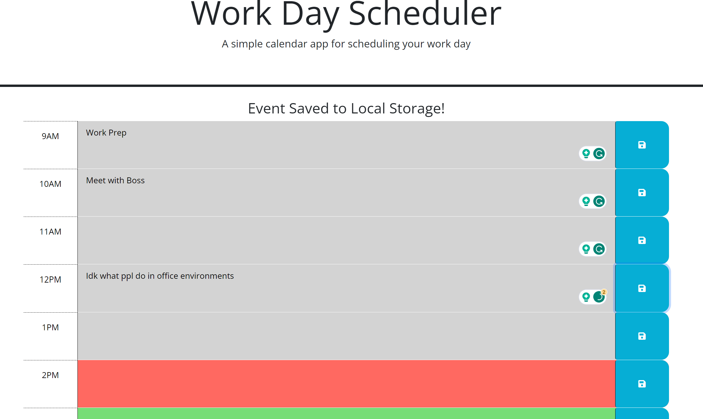

# Work-Day-Calendar-Assignment

## About:

My fifth assignment for the U of U web development bootcamp. This website will allow to keep track of hours in a standard work day and edit and save events posted to local storage.

## ScreenShot:

## Deployed Page:

https://c-hickman23.github.io/Work-Day-Calendar-Assignment/

## Credit:

Starter code provided by Edx / University of Utah
JavaScript written by Cardon Hickman
